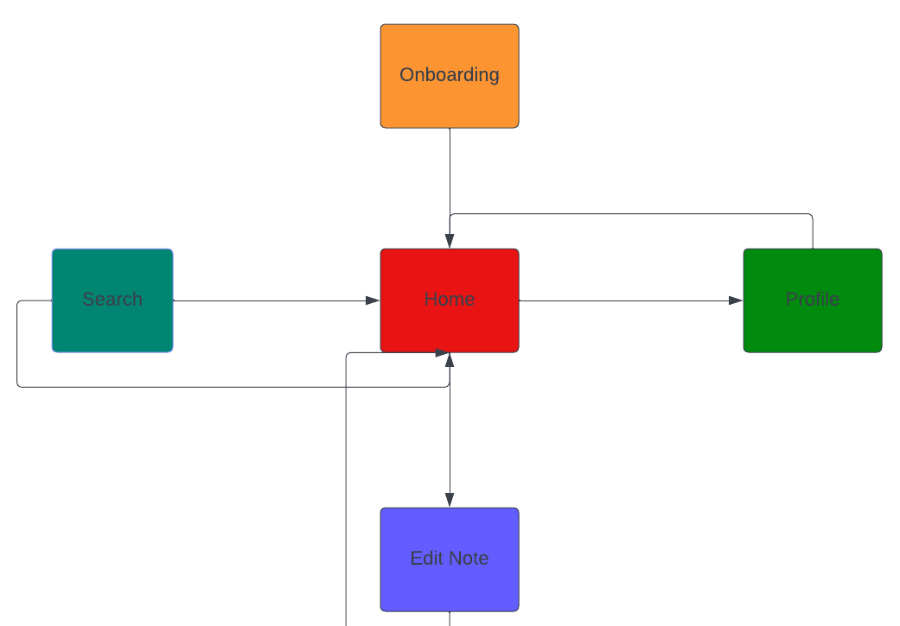
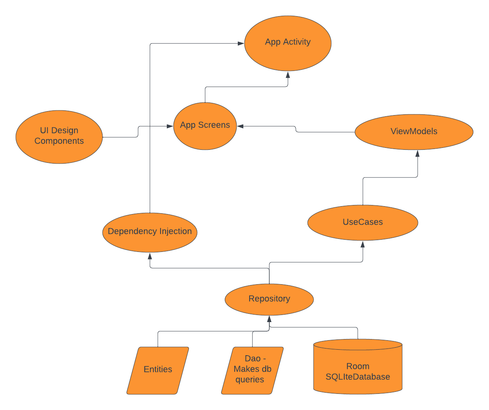

# JotSpot
JotSpot is a modern Android note-taking application built using the latest Android development technologies. 
It provides users with a seamless and efficient way to create, manage, and organize their notes.
This app leverages Room for local data storage and Jetpack Compose for creating a beautiful and responsive user interface.

## Tech Stack.
- [Kotlin](https://developer.android.com/kotlin) - Kotlin is a programming language that can run on JVM. Google has announced Kotlin as one of its officially supported programming languages in Android Studio; and the Android community is migrating at a pace from Java to Kotlin.
- Jetpack components:
    - [Jetpack Compose](https://developer.android.com/jetpack/compose) - Jetpack Compose is Android’s modern toolkit for building native UI. It simplifies and accelerates UI development on Android. Quickly bring your app to life with less code, powerful tools, and intuitive Kotlin APIs.
    - [Android KTX](https://developer.android.com/kotlin/ktx.html) - Android KTX is a set of Kotlin extensions that are included with Android Jetpack and other Android libraries. KTX extensions provide concise, idiomatic Kotlin to Jetpack, Android platform, and other APIs.
    - [AndroidX](https://developer.android.com/jetpack/androidx) - Major improvement to the original Android [Support Library](https://developer.android.com/topic/libraries/support-library/index), which is no longer maintained.
    - [Lifecycle](https://developer.android.com/topic/libraries/architecture/lifecycle) - Lifecycle-aware components perform actions in response to a change in the lifecycle status of another component, such as activities and fragments. These components help you produce better-organized, and often lighter-weight code, that is easier to maintain.
    - [ViewModel](https://developer.android.com/topic/libraries/architecture/viewmodel) -The ViewModel class is designed to store and manage UI-related data in a lifecycle conscious way.
    - [Room database](https://developer.android.com/training/data-storage/room) - The Room persistence library provides an abstraction layer over SQLite to allow fluent database access while harnessing the full power of SQLite. -

- [Kotlin Coroutines](https://developer.android.com/kotlin/coroutines) - A concurrency design pattern that you can use on Android to simplify code that executes asynchronously.
- [Kotlin Flow](https://developer.android.com/kotlin/flow) - In coroutines, a flow is a type that can emit multiple values sequentially, as opposed to suspend functions that return only a single value.
- [Dagger Hilt](https://developer.android.com/training/dependency-injection/hilt-android) - A dependency injection library for Android that reduces the boilerplate of doing manual dependency injection in your project.
- [Navigation Library](https://developer.android.com/jetpack/compose/navigation) - A KSP library that processes annotations and generates code that uses Official Jetpack Compose Navigation under the hood. It hides the complex, non-type-safe and boilerplate code you would have to write otherwise.
- [Coil](https://coil-kt.github.io/coil/compose/)- An image loading library for Android backed by Kotlin Coroutines.
- [Timber](https://github.com/JakeWharton/timber)- A logger with a small, extensible API which provides utility on top of Android's normal Log class.

### JotSpot Features
- App will have the following features:

  

- Onboarding - checks user onboarding status, collects user information name, avatar, theme preference
- Home - Displays Notes, Delete All Notes, Navigates to search and Profile, select a note to view
- Edit Note - Create/Edit Note, Return to Home
- Search - search for notes,displays search results, return to Home, select a note to view
- Profile - edit user name, image and theme preference(light,dark mode), return to Home

### JotSpot Architecture Design 
- This is the design pattern used to develop the application
- MVVM architecture

  

1. Entities models for the Notes table.
2. Dao to make queries from SQLite DB
3. Database
4. Repository that contains business logic of SQLite database and the whole application
5. Dependency Injection to reduce boiler plate code when creating instances of objects, i.e, view-model, repository, dao, Room DB and use-cases
6. UseCases recommend for breaking down the app features to per class/object
7. ViewModels handles lifecycle for the application
8. Compose Screens contains the UI screens ,i.e, home, search....
9. UI Components - This is material design components or reusable widgets.
10. App/ Activity - This is the main activity for the application

### Functional Requirements

1. User Registration: New users can register with a unique username, select a profile image, and choose their preferred theme.
2. Create and Edit Notes: Users can create new notes, edit existing ones, and organize them by category or tags.
3. View and Search Notes: The app allows users to view their notes, search for specific notes tags, and sort them by date, category, or title.
4. Profile Customization: Users can personalize their profiles by editing their username, profile image, or theme preference.
5. Onboarding: New users go through an onboarding process to set up their profile and preferences.
6. Data Backup: Regular data backups prevent data loss.
7. Offline Access: Users can access and edit their notes offline, with changes syncing when back online.

### Non-Functional Requirements

1. Performance Testing: Undergoes rigorous performance testing to ensure responsiveness.
2. Data Backup: Implements regular data backup to prevent data loss.
3. Performance: The app provides a smooth and responsive user experience, even with a large number of notes. Loading times for notes and search results should be minimal.
4. Security: User authentication should be robust to prevent unauthorized access.
5. Usability: The user interface is intuitive and user-friendly.
6. Scalability: The app is designed to accommodate potential future growth in terms of users and data.
7. Theme Customization: Theme preferences is flexible, allowing users to switch between different themes.
8. Offline Access: Users are able to access and edit their notes even when offline.
9. Error Handling: The app handles errors gracefully.

### Usage
# To use the MAD Note App, follow these steps:

- Clone the repository to your local machine.
- Open the project in Android Studio.
- Build and run the app on your Android device or emulator.
- Register or log in to start using the app.
- Start taking organized notes with ease using the MAD Note App!

